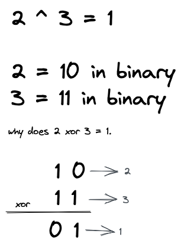
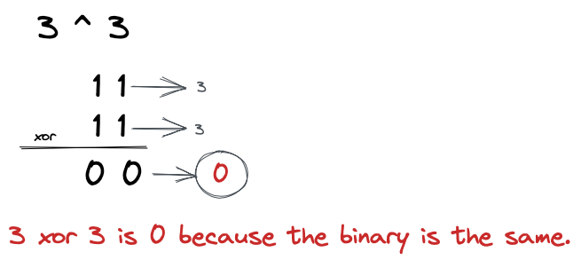
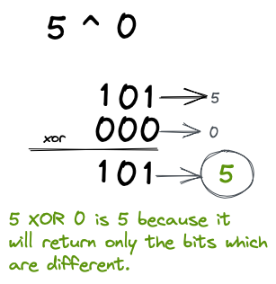

# 136. Missing Number

[Leetcode question 136](https://leetcode.com/problems/single-number/)

This question is very similar to [268 missing number](../268-Missing_Number/readme.md)

We can utilize the Bitwise **XOR** operator **^**

### XOR ^

The Bitwise XOR operator will return true / 1 if the bits are different.



So what if we used XOR on the same number?



So if we have multiple numbers with every number appearing twice except one. Then we know
all the doubles when we use XOR will equate to 0. So what if we then did 0 XOR the single number?



Therefore
```
4 ^ 1 ^ 2 ^ 1 ^ 2 =

4 ^ (1 ^ 1) ^ (2 ^ 2) =

4 ^ 0 ^ 0 =

4
```

### Space Time Complexity
**Time** O(n) because we only do xor n times.
**Space** O(1) because we only have to keep track of the single number.