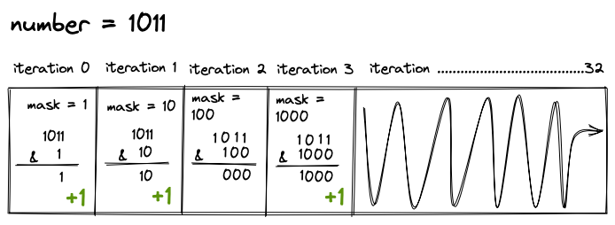
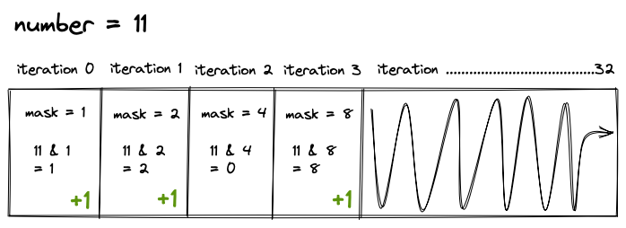
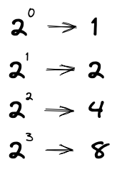

# 191. Number of 1 bits

[LeetCode Question 191](https://leetcode.com/problems/number-of-1-bits/)

In the question it says we get the following as input
```
Input: n = 00000000000000000000000000001011
```
Then why is it when we log out the input it is just the number 11?
The reason being is because the number 11 is represented as 1011 in binary.

So even though we read these as normal integers what we are really doing is manipulating
the bits of these numbers using bitwise operators. When we use bitwise operators on regular
integers what we are actually doing is manipulating the binary representation for those integers.

The input for our method will be a **uint32_t** which is an unsigned integer which guarantees
there will be 32 bits meaning that the number can range from
0 to (2^32 - 1) or 0 to 4294967295.

What we can do is create a loop that iterates 32 times because we have 32 bits and at each iteration of the loop we can use a bit mask that increases on each iteration of the loop so that way we can check to see the bit at each position for the number provided.

### Bitwise & Operator
We can create a bit mask using the **&** operator.



The Above converted to regular numbers looks as follows.



Notice how the bit mask doubles each time. Thats because every time we add a 1
to the front of our binary we are doing the following.



So how is it we can achieve this behavior of shifting the binary 1 place to the left ie:
1 -> 10 -> 100 -> 1000

### Bitwise << Left Shift operator.

Using the Bitwise left shift operator **<<** will take our number and shift the binary representation one to the left each time and if we do this 32 times and use it with the bitwise **&** operator on the number provided we will be able to distinguish if the bit at that position is in fact a 1. In which case we have a global counter which we increment to keep track of the number of bits.

### Space Time Complexity
**Space** O(1) as the only thing we need to keep track of is the number of bits and the mask
which is O(2) but constant numbers get rounded down to so therefore it is O(1).
**Time** O(1) We iterate 32 times every time because it is a 32 bit number. It would be O(32) but because it is a constant number we can just say O(1).

