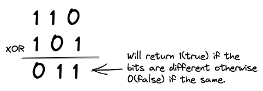
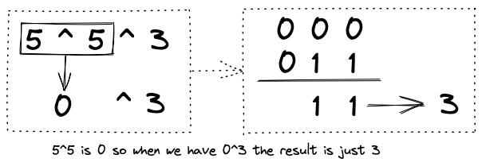
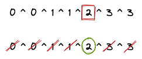

# 268. Missing Number

[LeetCode Question 268](https://leetcode.com/problems/missing-number/)

The efficient way to solve this question is to use the Bitwise **XOR** operator. The way in which the Bitwise XOR operator works is by comparing binary and return true if the Bits are different.



The same applies to regular numbers. if we were to XOR 3 ^ 3 then the result would be 0 as both numbers are the same. If instead it was XOR 2 ^ 3 then the result would be 1.

The way in which we can apply this to multiple numbers is as follows.



Therefore if we have duplicate numbers they would just all cancel out and become 0. Leaving us with the number which is different.



You can see this when you do the following:
```
cout << (5 ^ 5); // 0
cout << (0 ^ 5); // 5
cout << (5 ^ 5 ^ 3); // 3
```

### SpaceTime Complexity
**Time**: O(n) as we only have to loop once.
**Space** O(1) as we only have to keep track of the missing number.