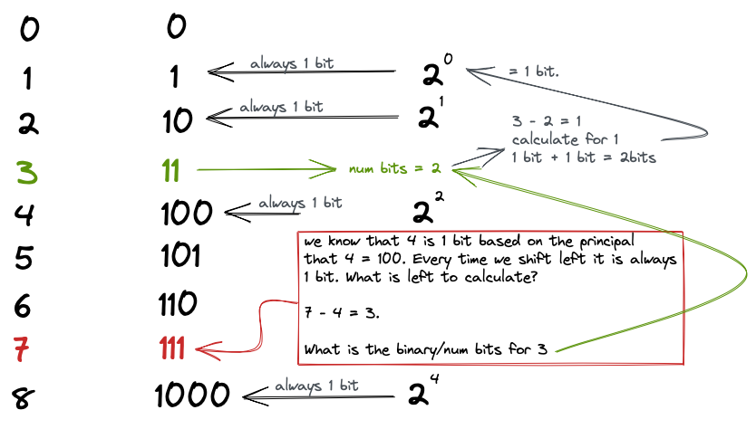

# 338. Counting Bits

[LeetCode Question 338](https://leetcode.com/problems/counting-bits/)

My First Solution was to go with using the Hamming Weight Solution which is just a repeat
of question [191. number of 1 bit](../191-Number_Of_1_Bits/readme.md) which we just repeat for each number starting from 0 up to n+1.

This would not be optimal as we have to loop through 32 times for each number.

### Dynamic Programming Approach.

Every time we reach a new base 2 ie: 1 -> 2 -> 4 -> 8 the number of bits will always be 1.
```
1
10
100
1000
```
Though what about the numbers in-between. Well we have already calculated these at some point.
For example if we are calculating the number 7 which is 111 in binary. We know that there will be 1 binary digit at the front ie 100 which is 4. And whats the difference of 4 and 7 the answer is 3. So if we look at the number of digits calculated for 3 we can see it is 2. Therefore the answer is just 1 + 2 = 3.

#### Calculate the number of bits for the number 7.


```
Therefore:

number 3 = 2 bits

number 4 = 1 bits

3 + 4 = 7 which is our number

2 bits + 1 bit = 3 bits.
```

### Space Time Complexity
**Time** O(n) Because we iterate through n + 1 times we can neglect the constant n and say O(n).
**Space** O(1) We do have to create an array which is O(n) space but because this is what we also use for the output we can neglect this and say it is O(1).