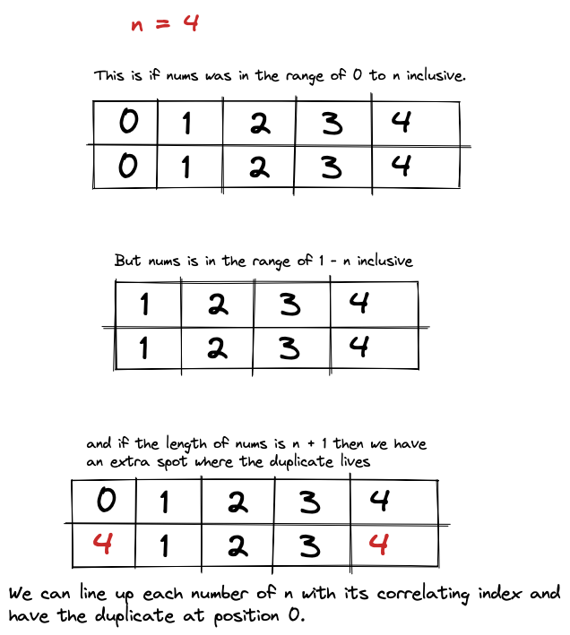
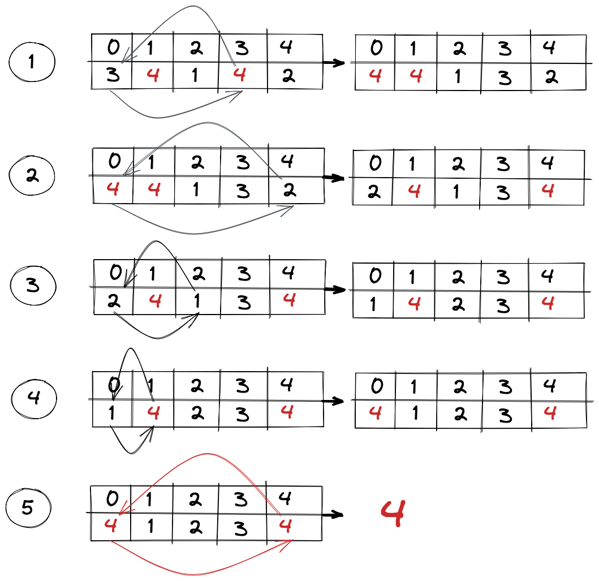

# 287. Find the Duplicate Number

[question 287 - Find the duplicate number](https://leetcode.com/problems/find-the-duplicate-number/)

Being a bit manipulation question and the inverse of [136 - single number](../../Easy/136-Single_Number/readme.md). 
I assumed that we would be using the XOR operator and somehow finding the inverse. The XOR is a nice trick for finding
duplicated numbers or missing numbers but in this case we did not use any Bit Manipulators for this question.

If we look at the constraints for this question it may give us some hints as to how we might approach this question.

```
1 <= n <= 105

nums.length == n + 1

1 <= nums[i] <= n

All the integers in nums appear only once except for precisely one integer which appears two or more times.
```

We also see that in the question description it states
**each integer is in the range [1, n] inclusive.**

Therefore if the numbers were not mixed then we would have something along the lines of:



The numbers will be in a random order. So how can we get them in order?
Well if each number belongs with its index then we can simply use that number and swap
it with the number at that index. The way in which we can go about doing that is to 
consistently swap the number at index 0. Though when we get to the duplicate and we go to swap it with the number at its index which is also the same this will cause an infinite loop. In this case we just add a check to see if they are the same and if so then we have found the duplicate.



### Space Time Complexity
**Time**: O(n) We would have to do at most n + 1 iterations. Therefore the time complexity
would just be O(n).
**Space**: O(1) We have to keep track of a temp value when we do the swap.