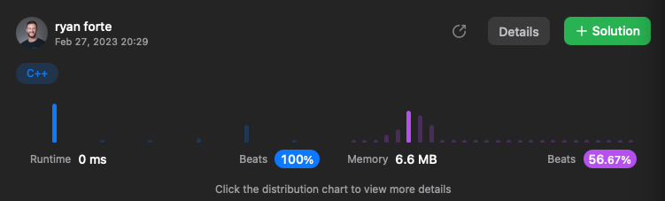

[394. Decode String](https://leetcode.com/problems/decode-string/description)

### Notes
Looking at this question I knew straight away it was a recursive question because we would use the [ to step in to the next function and ] to step out.

One thing that made a massive difference to my time and space was instead of passing a string through each function call I instead passed a reference to the string and labeled it const as to not have it changed. Having the string as a reference greatly increased my time from bottom 9% to top 100% as I was no longer copying the string but instead passing it by reference.