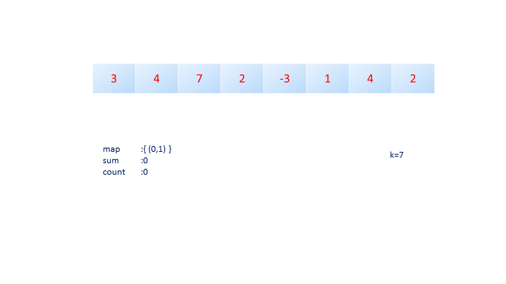
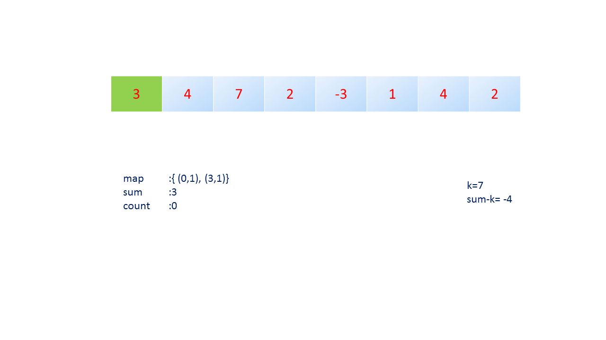
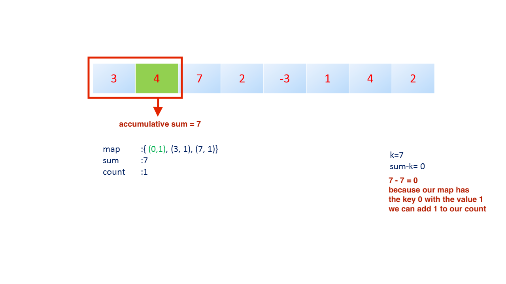
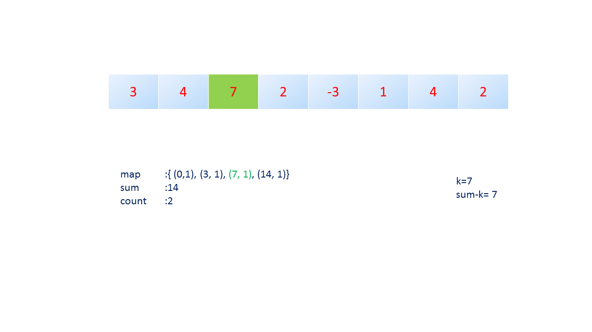
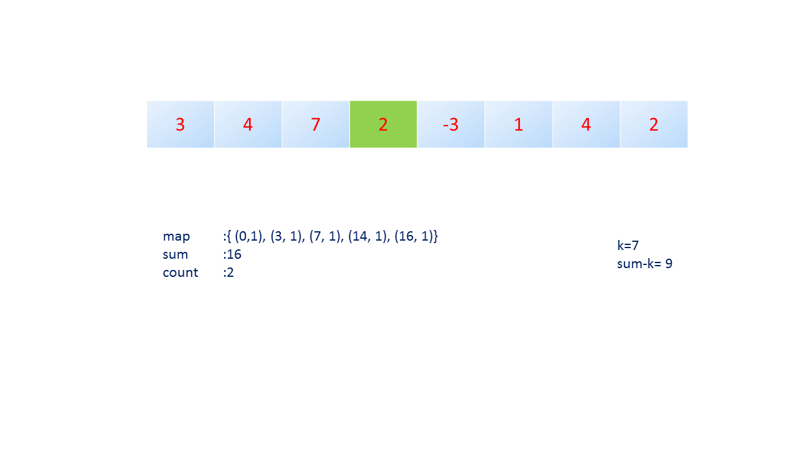
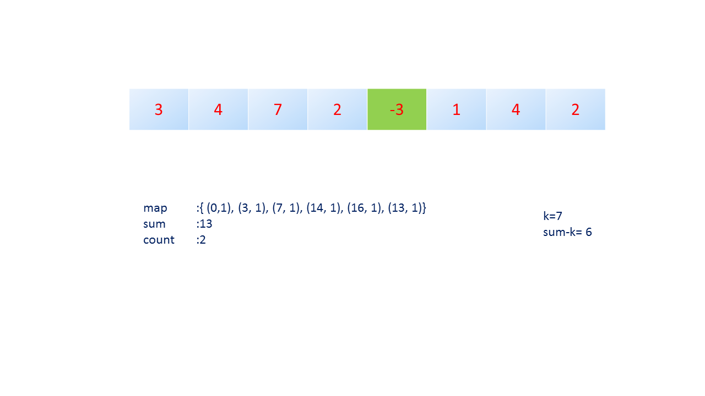
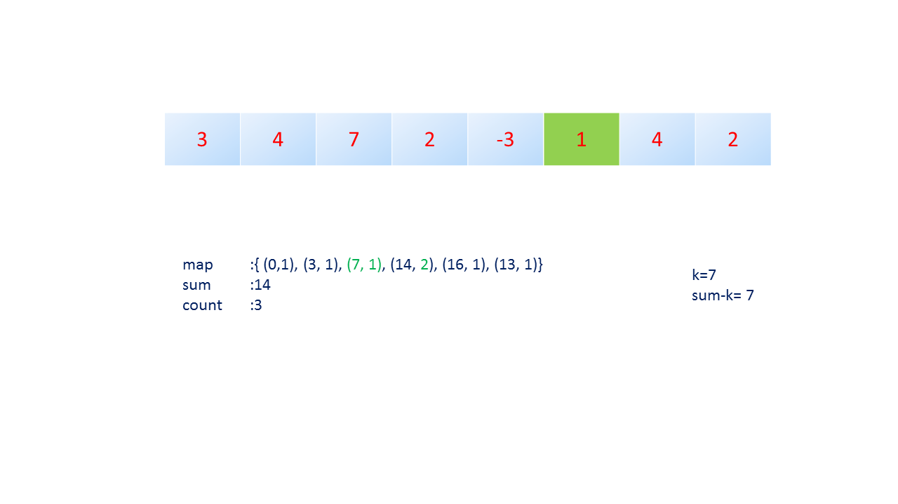
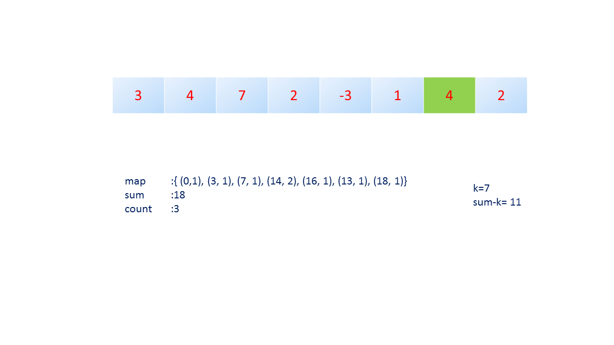
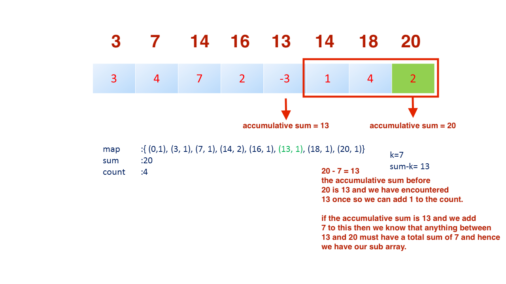

## [560. Subarray Sum Equals K](https://leetcode.com/problems/subarray-sum-equals-k/description/)

With this problem we are expected to find all the sub arrays which have a total sum of __K__.

The brute force approach involves an O(n^3) time because we have to start with an __i__ and __j__ pointer on the first number,
move the j through all numbers to the end while calculating the sum between i and j for each iteration of j. Once j gets
to the end we then need to move i one place forward and reset j to the position of i. We then repeat this process.

We can find all the sub arrays with all sums equal to __K__ in O(n) time and O(n) space using an __accumulative sum__.

We need to keep track of each sum in the map and the number of times the sum occurred. We initialize our map with the value 0 and the value of 1 because we start our sum with 0 and it has occurred once.

Why do we add how many times we encountered the sum to the count?

The HashMap will store with the key being any particular sum, and the value being the number of times it has happened till the current iteration of the loop as we traverse the array from left to right.
For example:
__k = 26__.
If a sub-array sums up to k, then the sum at the end of this sub-array will be sumEnd = sumStart + k. That implies: sumStart = sumEnd - k.
Suppose, at index 10, sum = 50, and the next 6 numbers are 8,-5,-3,10,15,1.
At index 13, sum will be 50 again (the numbers from indexes 11 to 13 add up to 0).
Then at index 16, sum = 76.
Now, when we reach index 16, sum - k = 76 - 26 = 50. So, if this is the end index of a sub-array(s) which sums up to k, then before this, just before the start of the sub-array, the sum should be 50.
As we found sum = 50 at two places before reaching index 16, we indeed have two sub-arrays which sum up to k (26): from indexes 14 to 16 and from indexes 11 to 16.