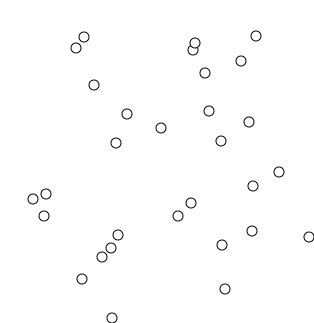

# Disjoint Set

The main idea of a “disjoint set” is to have all connected vertices have the same parent node or root node, whether directly or indirectly connected. To check if two vertices are connected, we only need to check if they have the same root node.

The two most important functions for the “disjoint set” data structure are the find function and the union function. The find function locates the root node of a given vertex. The union function connects two previously unconnected vertices by giving them the same root node. There is another important function named connected, which checks the “connectivity” of two vertices. The find and union functions are essential for any question that uses the “disjoint set” data structure.

## Implementation of the “disjoint set”
```
class UnionFind {
public:
    // Constructor of Union-find. The size is the length of the root array.
    UnionFind(int sz) : root(sz);
    int find(int x);
    void unionSet(int x, int y);
    bool connected(int x, int y);
};
```

## find function of the “disjoint set”
__A basic implementation of the find function:__
```
int find(int x) {
    while (x != root[x]) {
        x = root[x];
    }
    return x;
}
```
__The find function – optimized with path compression:__
```
int find(int x) {
    if (x == root[x]) {
        return x;
    }
    return root[x] = find(root[x]);
}
```

## union function of the “disjoint set”
The “disjoint set” mainly uses the union function to connect two vertices, x, and y, by equating their root node.
__A basic implementation of the union function:__
```
void unionSet(int x, int y) {
    int rootX = find(x);
    int rootY = find(y);
    if (rootX != rootY) {
        root[rootY] = rootX;
    }
}
```
__The union function – Optimized by union by rank:__
```
  void unionSet(int x, int y)
  {
    int rootX = find(x);
    int rootY = find(y);
    if (rootX != rootY)
    {
      if (rank[rootX] >= rank[rootY])
      {
        root[rootY] = rootX;
        rank[rootX] += rank[rootY];
      }
      else
      {
        root[rootX] = rootY;
        rank[rootY] += rank[rootX];
      }
    }
  }
```

## connected function of the “disjoint set”
The connected function checks if two vertices, x and y, are connected by checking if they have the same root node. If x and y have the same root node, they are connected. Otherwise, they are not connected.
```
bool connected(int x, int y) {
    return find(x) == find(y);
}
```

## Tips for using the “disjoint sets” data structure in solving LeetCode problems
The code for the disjoint set is highly modularized. You might want to become familiar with the implementation. __I would highly recommend that you understand and memorize the implementation of “disjoint set with path compression and union by rank”.__

Finally, we strongly encourage you to solve the exercise problems using the abovementioned implementation of the “disjoint set” data structure. Some of these problems can be solved using other data structures and algorithms, but we highly recommend that you practice solving them using the “disjoint set” data structure.

## Optimized Union Find
```
class UnionFind
{
private:
  vector<int> root;
  vector<int> rank;

public:
  // Initialize the array root and rank
  // Each vertex is representative of itself with rank 1
  UnionFind(int sz) : root(sz), rank(sz)
  {
    for (int i = 0; i < sz; i++)
    {
      root[i] = i;
      rank[i] = 1;
    }
  }

  // Get the root of a vertex
  int find(int x)
  {
    if (x == root[x])
    {
      return x;
    }
    return root[x] = find(root[x]);
  }

  // Perform the union of two components
  void unionSet(int x, int y)
  {
    int rootX = find(x);
    int rootY = find(y);
    if (rootX != rootY)
    {
      if (rank[rootX] >= rank[rootY])
      {
        root[rootY] = rootX;
        rank[rootX] += rank[rootY];
      }
      else
      {
        root[rootX] = rootY;
        rank[rootY] += rank[rootX];
      }
    }
  }
};
```

## Minimum Spanning Tree (MST)
A minimum spanning tree (MST) or minimum weight spanning tree is a subset of the edges of a connected, edge-weighted undirected graph that connects all the vertices together, without any cycles and with the minimum possible total edge weight.


### Prims Algorithm
Prim's (also known as Jarník's) algorithm is a greedy algorithm used to find the minimum spanning tree in a weighted and undirected graph.

The algorithm operates by building the tree one vertex at a time, from an arbitrary starting vertex, at each step adding the cheapest possible connection from any vertex in the tree to a vertex that is not in the tree.


To implement Prim's algorithm, essentially we will need the following three data structures:

- **adjacency list**: we need this to represent the graph, i.e. vertices and edges. The adjacency list can be a list of lists or a dictionary of lists.


- **set**: we need a set to maintain all the vertices that we have added to the final minimum spanning tree, during the construction of the tree. With the help of set, we can determine whether a vertex has been added or not.

- **heap**: due to the nature of the greedy strategy, at each step, we can determine the best edge to be added based on the cost it will add to the tree. Heap (also known as a priority queue) is a data structure that allows us to retrieve the minimum element in constant time and to remove the minimum element in logarithmic time. This fits our need to repeatedly find the lowest cost edge perfectly. [Implement Heap with Priority Queue](https://www.youtube.com/watch?v=JSqznrzWGvc)


### Kruska's Algorithm
Similiar to Prim's algorithm, Kruskal's algorithm applies the greedy strategy to incrementally add new edges to the final solution.



A major difference between them is that in Prim's algorithm the MST (minimal spanning tree) remains connected as a whole throughout the entire process, while in Kruskal's algorithm, the tree is formed by merging the disjoint components together.

**The overall idea of Kruskal's algorithm is that we iterate through all the edges ordered by their costs.** For each edge, we decide whether to add it to the final MST. The decision is based on whether this new addition will help to connect more dots (i.e. vertices).


A more concise criteria to determine whether we should add a new edge in Kruskal's algorithm is that whether both ends of the edge belong to the same component (group).

