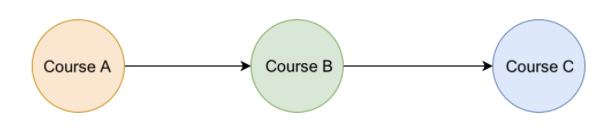

# Kahn's Algorithm

Prerequisite relationships between courses
You have to take CourseB before CourseC and CoursA before CourseB.

**Topological sorting** helps solve the problem. It provides a linear sorting based on the required ordering between vertices in directed acyclic graphs. To be specific, given vertices u and v, to reach vertex v, we must have reached vertex u first. In “topological sorting”, u has to appear before v in the ordering. The most popular algorithm for “topological sorting” is Kahn’s algorithm.

### Limitations
- _Topological sorting_ only works with graphs that are directed and acyclic.
- There must be at least one vertex in the “graph” with an “in-degree” of 0. If all vertices in the “graph” have a non-zero “in-degree”, then all vertices need at least one vertex as a predecessor. In this case, no vertex can serve as the starting vertex.

### Complexity Analysis
**Time Complexity** O(V + E)
- Building the Adjacency list takes O(E) time as we must iterate over all the edges.
- Repeatedly visit each vertex with an In-Degree of 0. Worst case scenario we visit every vertex and decrement its In-Degree once which is O(V).
- This leaves us with a time complexity of O(V + E)

**Space Complexity** O(V + E)
- The adjacency list uses O(E) space.
- Storing the in-degree for each vertex requires O(V) space
- The queue can also contain at most every vertex O(V)
- This leaves us with O(2V + E). Simplified is O(V + E)