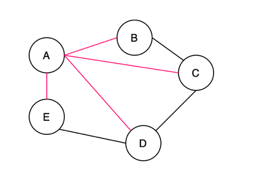

# Spanning Tree
A **Spanning Tree** is a connected subgraph in an undirected graph where
all vertices are connected with the minimum number of edges.

all pink edges [(A, B), (A, C), (A, D), (A, E)] form a tree, which is a spanning tree of this undirected graph. Note that [(A, E), (A, B), (B, C), (C, D)] is also a spanning tree of the undirected graph. Thus, an “undirected graph” can have multiple spanning trees.

A **Minimum Spanning Tree** is a spanning tree with the minimum possible total edge weight in a **weighted undirected graph**.

