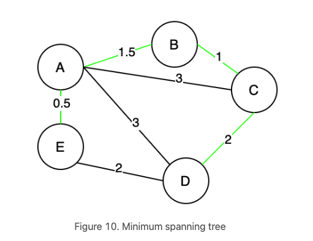

# Spanning Tree
A **Spanning Tree** is a connected subgraph in an undirected graph where
all vertices are connected with the minimum number of edges.

all pink edges [(A, B), (A, C), (A, D), (A, E)] form a tree, which is a spanning tree of this undirected graph. Note that [(A, E), (A, B), (B, C), (C, D)] is also a spanning tree of the undirected graph. Thus, an “undirected graph” can have multiple spanning trees.

A **Minimum Spanning Tree (MST)** is a spanning tree with the minimum possible total edge weight in a **weighted undirected graph**.

## Cut Property

- In Graph theory a **cut** is a partition of vertices split into two disjoint sets. (B, A, E) forms one subset, and (C, D) forms the other subset.
- A **crossing edge** is an edge that connects a vertex in one set with a vertex in another set. (B, C), (A, C), (A, D), (E, D) are all “crossing edges”.

**For any cut C of the graph, if the weight of an edge E in the cut-set of C is strictly smaller than the weights of all other edges of the cut-set of C, then this edge belongs to all MSTs of the graph.**

