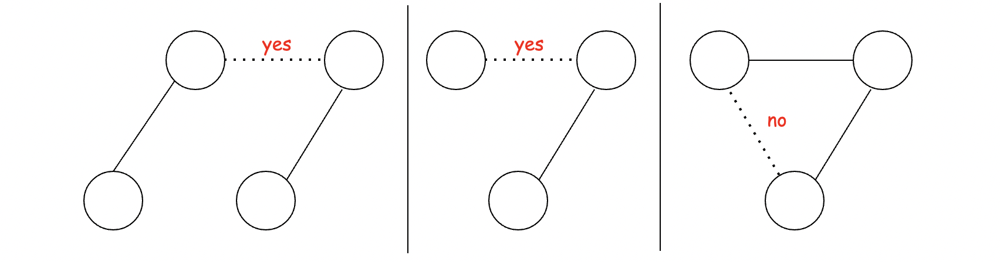
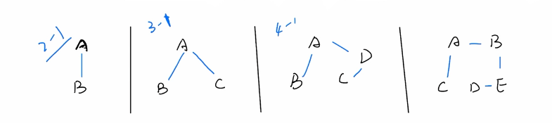

# Kruskal's Algorithm

“Kruskal’s algorithm” is an algorithm to construct a “minimum spanning tree” of a “weighted undirected graph”.

A major difference between them is that in Prim's algorithm the MST (minimal spanning tree) remains connected as a whole throughout the entire process, while in Kruskal's algorithm, the tree is formed by merging the disjoint components together.

**The overall idea of Kruskal's algorithm is that we iterate through all the edges ordered by their costs.** For each edge, we decide whether to add it to the final MST. The decision is based on whether this new addition will help to connect more dots (i.e. vertices).

A more concise criteria to determine whether we should add a new edge in Kruskal's algorithm is that whether both ends of the edge belong to the same component (group).

#### Kruskal’s Algorithm only choose N-1 edges

Kruskal's algorithm will always have **n - 1** edges. Any more edges and we will form a cycle.

### Complexity Analysis
##### O(E⋅logE). Here, E represents the number of edges

- Sorting the edges takes **O(ElogE)**.
- Build the MST (Minimum Spanning Tree) **O(α(V))**. **α** refers to inverse Ackermann function.

_Inverse Ackermann function = A function of two parameters whose value grows very, very slowly._

- Worst case the tree will not be complete until we reach the last edge **O(Eα(V))**

Total = **O(ElogE+Eα(V))** = **O(ElogE)**
