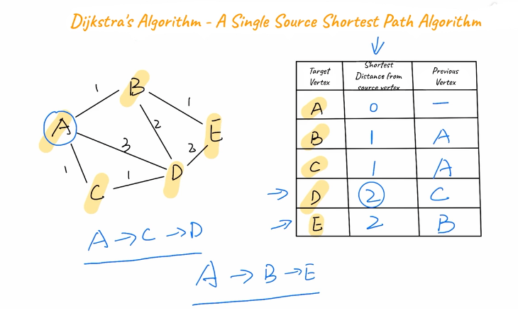

# Dijkstra's Algorithm

We start with the target vertex, shortest distance from the source vertex and the previous vertex.

Choose a vertex. **A**

Set all paths we have not traversed to infinity.

Traverse all paths connected to A. Update table to include the
distance and the previous vertex.

Once visited all neighbouring vertices you can mark A as visited.

Next we choose a vertex with the shortest path. We go with C but this could have been either A or B.

C has two edges. One to A and one to D. We do not need to check A 
because it has been marked as visited.

Because A -> C -> D has length 2 which is shorter than A -> D length 3 then we can go and update the chart by replacing the D which had a 3 to a 2 and the A can change to a C.

