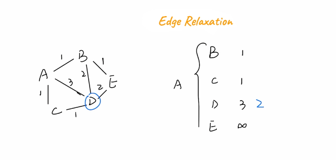

# Single Source Shortest Path Algorithm
**Dijkstra's algorithm** can only be used to solve the 'single source shortest path'
problem in graphs with *non negative weights*.

**Bellman-Ford algorithm** can solve the 'single source shortest path' in a *weighted directed graph*
 with any weights including *negative weights*.

 ### Edge Relaxation

 
 The Path from A - D is 3.
 If we go through C so A - C - D then the path is 2.
 So we can assign 2 to D. 

 An alternative way to understand why this process is called ‘relaxation’ is to imagine that each path is a rubber band of length 1. The original path from A to D is of length 3, so the rubber band was stretched to 3 times its original length. When we relax the path to length 2, by visiting C first, the rubber band is now only stretched to twice its length, so you can imagine the rubber band being relaxed, hence the term edge relaxation.