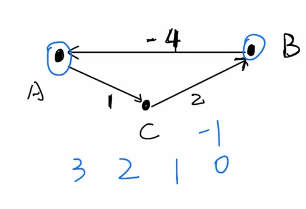
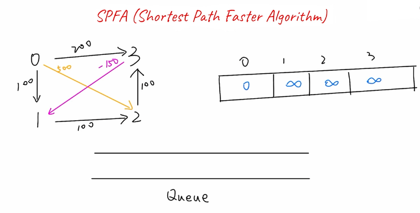

# Bellman Ford Alogorithm
used foro solving the shortest path in a graph with negatively weighted edges.

### DAG Directed Acyclic Graph
a directed graph which forms a cycle.

**In a graph with no negative weight cycles with N vertices, the shortest path between any two vertices has at most N-1 edges**

**In a graph with negative weight cycles. There is no shortest path.**
In the diagram below we can see that every time we go around the cycle the sum of the edges decreases by 1. Therefore this can go on forever and as a result we just say that in this scenario there is no shortes path.

### Dynamic Programming
The Bellman Ford algorithm is an improved dynamic programmig algorithm.

### Complexity Analysis
**Time Complexity:** we iterate through all the vertices, and in each iteration, we'll perform a relaxation operation for each appropriate edge. Therefore, the time complexity would be O(V*E)

**Space Complexity:** O(V) We use two arrays of length V. One to store the shortest distance from the source vertex using at most k-1 edges. The other is to store the shortest distance from the source vertex using at most k edges.

# Shortest Path Faster Algorithm (SPFA)
Instead of choosing among any untraversed edges, as one does by using the “Bellman-Ford” algorithm, the “SPFA” Algorithm uses a “queue” to maintain the next starting vertex of the edge to be traversed. Only when the shortest distance of a vertex is relaxed and that the vertex is not in the “queue”, we add the vertex to the queue. We iterate the process until the queue is empty. At this point, we have calculated the minimum distance from the given vertex to any vertices.

Note that the time complexity of the improved version of the algorithm for the worst-case scenario is the same as of the standard version of the Bellman-Ford Algorithm. However, on average, the SPFA tends to be faster.