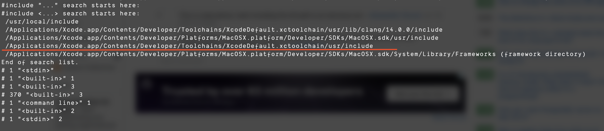
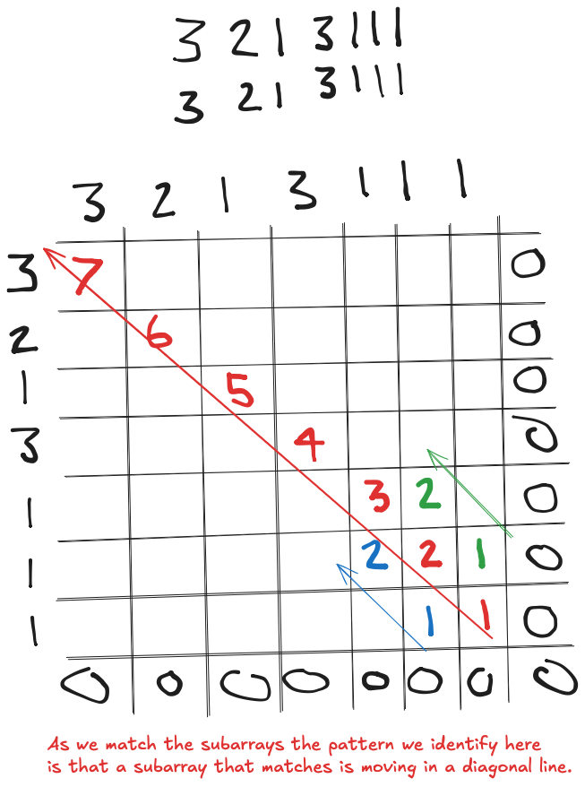
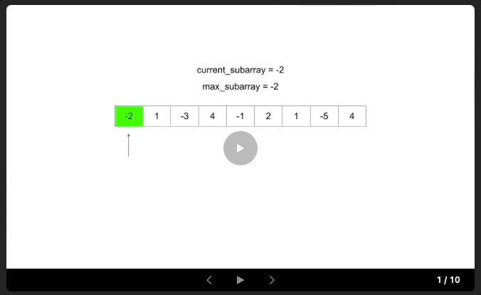
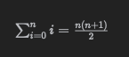

Contains my answers to problems solved on variouse competitive programming sites

### [Code Template](./CODE_TEMPLATES.md)

### Setting up C++ in VSCode

[Using Clang in Visual Studio Code](https://code.visualstudio.com/docs/cpp/config-clang-mac)

### Using bits/stdc++.h

bits/stdc++ is a GNU GCC extension, whereas OSX uses the clang compiler. So we will not have access to this header.
In order to add this header we have to first find out where to put it.

run:

```
echo "" | gcc -xc - -v -E
```

This will give you a large sum of output but what we want is to find where it uses the #include


look for the one with `include` at the end.

Once we have this lets go into that directory and make a new directory called **bits**

```
cd /Applications/Xcode.app/Contents/Developer/Toolchains/XcodeDefault.xctoolchain/usr/include
```

```
sudo mkdir bits
```

now go into bits and add [stdc++.h](https://github.com/gcc-mirror/gcc/blob/master/libstdc%2B%2B-v3/include/precompiled/stdc%2B%2B.h)

run the following command in the same directory as the stdc++.h file. Note that the path you are copying should match the 'include' path
you retrieved earlier.

```
sudo cp stdc++.h /Applications/Xcode.app/Contents/Developer/Toolchains/XcodeDefault.xctoolchain/usr/include/bits/stdc++.h
```

note there where a few issues with the \_\_cplusplus preprocessor macro so a had to move a few of the libraries around but once I did
that it seemed to be working fine.

### Note

We use C++ 17 because LeetCode does not support C++ 20

---

---

---

---

---

---

---

---

# DSA Algorithms and Tips

### Always identify constraints

Always suss out your constraints. Example graph question constraints:

- `n == rooms.length`
- `2 <= n <= 1000` the array length is between 2 and 1000
- `0 <= rooms[i].length <= 1000` the adjacency list values have an array length between 0 and 1000
- `1 <= sum(rooms[i].length) <= 3000`
- `0 <= rooms[i][j] < n` the value in the adjacency list is always less than n
- `All the values of rooms[i] are unique.` each value in the adjacency list for the node is unique

---

### Stacks

A lot of parsing questions (valid parentheses, braces, parsing math expressions),
and basically anything where 'future data can impact earlier'.
Another pattern would be monotonically increasing / decreasing stack questions, where you eliminate all entries greater / less
than on each iteration.

---

### Dynamic Programming

Two common use cases:

- Finding an optimal solution ie: max or min
- Counting the total number of solutions for a problem

examples may include:

- What is the minimum cost of doing...
- What is the maximum profit from...
- How many ways are there to do...
- What is the longest possible...
- Is it possible to reach a certain point...

**2D vs 1D**
Identifying a 2D dynamic programming problem can be tricky but with DP especially top down it is all about memoization.
If I have a question where im trying to see if I can make 'X' give items 'Y' and I can reuse items 'Y' as many times as I like then why bother
keeping track of 'Y' because 'Y' is not important in this case because I can just reuse it as much as I like because in the end all I care about
is if I can make 'X' from 'Y'. This is a good example of 1D because no need to keep track of Y's state.

If on the other hand I can not reuse 'Y' and I can only use these items once well now I need a way to keep track of what I have/havn't used. In this
case I need to keep track of Y's state. This is a good case for a 2D dynamic programming question.

So in the end ask yourself "do i need to keep track of theses items state?", if not then 1D otherwise 2D.
The state you need to track determines the dimension of the array.

- [322. Coin Change 1D question](LeetCode/Medium/322-coin-change/go/main.go)

Dynamic Programming can be performed in bottom-up (iterative) approach or top-down (recursive with memoization). If not sure how to perform
memoization for top-down think about memoizing the function call which in our case would be the arguments provided to the function at that time
of calling it. A good example of how I did this here [1770. Maximum Score from Performing Multiplication Operations](LeetCode/Hard/1770-maximum-score-from-performing-multiplication-operations/go/main.go)

**Sometimes** (i say sometimes because that may not always be the case) it can be easier to to do the top-down approach first and then translate this over to bottom-up for improved performance. A good example of this
is:

- [1143 Longest Common Subsequence](LeetCode/Medium/1143-longest-common-subsequence/go/main.go)
- [188 Best Time to Buy and Sell Stock IV](LeetCode/Hard/188-best-time-to-buy-and-sell-stock-iv/go/main.go)
- [714 Best Time to Buy and Sell Stock with Transaction Fee](LeetCode/Medium/714-best-time-to-buy-and-sell-stock-with-transaction-fee/)

cases where it was easier to perform bottom-up vs top-down:

- [718. Maximum Length of Repeated Subarray](LeetCode/Medium/718-maximum-length-of-repeated-subarray/go/main.go)
<p align="center">
  
</p>
**State Reduction** is a way in which we can reduce the number of states which will in turn reduce our space complexity and possibly our time complexity.
If you look at [House Robber](LeetCode/Medium/198-house-robber/go/main.go) especially the Top Down recursive approach we could have include another parameter which was
a boolean to indicate if we could/couldn't rob the house but instead we used the index's which reduced the state.

**Note: state reductions for space complexity usually only apply to bottom-up implementations, while improving time complexity by reducing the number of state variables applies to both implementations.**

Another common scenario for improving space complexity is when the recurence relation is static (no iteration) along one dimension (flat array). An example of this is
[nth fibonacci number](LeetCode/Easy/509-fibonacci-number/go/main.go). Because we only care about the previouse 2 fibonacci numbers there is no need to keep an array
holding all previouse fibonacci numbers.

---

### Dynamic Programming (Kadane's Algorithm)

Kadane's Algorithm is an algorith that can find the maximum sum subarray when given an array of numbers. Its time complexity is O(n) and space O(1).

```
// Given an input array of numbers "nums",
1. best = nums[0]
2. current = nums[0]
3. for num in nums[1:]: // start at index 1
    3.1. current = Max(current + num, num)
    3.2. best = Max(best, current)

4. return best
```

- [53. Maximum Subarray](LeetCode/Medium/53-maximum-subarray/go/main.go)
- [121. Best Time to Buy and Sell Stock](LeetCode/Easy/121-best-time-buy-sell-stock/go/main.go)
- [918. Maximum Sum Circular Subarray](LeetCode/Medium/918-maximum-sum-circular-subarray/go/main.go)



---

### Heaps / Priority Queue

- Good for finding the top **K** elements.
- Dijkstras algorithm for calculating the shortest path in weighted graphs.

---

### Sliding Window / 2 pointers

- The condition for using the sliding window technique is the problem asks to find the `max/min` value for a function that calculates
  the answer repeatedly for a set of `ranges` from the array.
  Example Leetcode 1004: Given a binary array nums and an integer k, return the maximum number of `consecutive 1's` (consecutive 1's creates a range)
  in the array if you can flip at most k 0's.

---

### BFS (Breadth First Search)

- Great for finding the shortest path in the graph.
- Can be used with priority queue to form Dijkstras algorithm to find shortest path in weighted graph

---

### Binary Search

Although binary search algorithms are typically used to find one element in a sorted sequence, they have many other uses.
You can apply a binary search to a result, for example. Say you wanted to determine the minimum square footage of office space needed to fit all a company's employees easily.
The square footage is a consecutive number and therefore sorted so we can perform binary search on it

---

### Floyd's Algorithm

Used for finding the start of a linked list cycle.

- [287 find-the-duplicate-number](https://leetcode.com/problems/find-the-duplicate-number/description/)
- [Floyd's cycle detection algorithm (Tortoise and hare)](https://www.youtube.com/watch?v=PvrxZaH_eZ4)

---

### GCD (Greatest Common Divisor) Euclidean algorithm

Used to find the greatest common divisor between two numbers

```go
func gcd(a, b int) int {
	if b == 0 {
		return a
	}
	return gcd(b, a%b)
}
```

---

### LCM (Least Common Multiple)

The Least Common Multiple of two numbers is the smallest multiple of those 2 numbers for example take LCM(6, 10)

Multiples of 6:
6, 12, 18, 24, `30`, 36, 42

Multiples of 10:
10, 20, `30`, 40, 50

Therfore the LCM(6, 10) = 30.

```
func lcm(a, b int) int {
	return (a * b) / gcd(a, b)
}
```

### Tarjan's Algorithm

Used to find the articulation point in a graph. An articulation point is a node that when removed will divide the graph into 2.

- [LeetCode Hard - 1568 minimum number of days to disconnect island](LeetCode/Hard/1568-minimum-number-of-days-to-disconnect-island/go/main.go).
- [YouTube: Tarjan's Strongly Connected Component (SCC) Algorithm (UPDATED) | Graph Theory](https://www.youtube.com/watch?v=wUgWX0nc4NY)

---

### Cyclic Arrays.

Sometimes you might have an array that cycles back arround.

For example this will always find the indexes 2 infront of the current index when the array is a loop.

```
(i + 1) % len(array) , (i + 2) % len(array)

```

```
i, arrLen := 1, 3
(i + 1) % arrLen = 2
(i + 2) % arrLen = 0 // looped back around
```

- [256 Paint House](LeetCode/Medium/256/go/main.go)
- [265 Paint House II](LeetCode/Hard/265-paint-house-2/go/main.go) _arrLen varies per input_

---

### Gauss' Formula

Find the sum all numbers up to n in O(1) time.
For example if I said find the sum of the first 100 numbers you could loop through all the numbers from [1..n]
to get the sum which would take O(n) time or you could use the below formula:



```
n := 100
sum := n * (n+1) / 2
```

### Bit Operations

#### AND (&)

Will produce a bit in the same position where x and y have the same bit.

```
  1 0 1 1 0 (22)
& 1 1 0 1 0 (26)
----------------
  1 0 0 1 0 (18)
```

Because in Binary even numbers always have their right most bit as 0 we can quickly determine if a number is even by:

```
x & 1 == 0
```

and converseley if its odd by (because odd numbers always have their right most bit as 1):

```
x & 1 == 1
```

#### OR (|)

Will produce a bit in the same position where one of the bits is 1.

```
  1 0 1 1 0 (22)
& 1 1 0 1 0 (26)
----------------
  1 1 1 1 0 (30)
```

#### XOR (^)

Will produce a bit in the same position where both bits are different.

```
  1 0 1 1 0 (22)
& 1 1 0 1 0 (26)
----------------
  0 1 1 0 0 (12)
```

An example of this can be found here [LeetCode 268 Missing Number](LeetCode/Easy/268-Missing_Number/go/main.go)

#### NOT (~)

Used to invert the bits. The formula ~x == -x - 1 holds true.
In Go there is no ~ operator but we can use XOR.

```
^29 = -30

This holds true to ~x == -x - 1
```

#### Bit Shift (<<) (>>)

Left bit shift << appends K zero bits to the number and Right bit shift >> removes K zero bits from the number.
NOTE:

```
x << k is the same as x * 2^k

x >> k is the same as x / 2^k
```

### 1e9 + 7

Some questions becasue the number can get really large ask you to mod by 1,000,000,007.
This is equivalent to 1e9+7.
1e9 is the same as saying 1 multiplied by 10^9.
Therefore we can do the following:

```
answer % (1e9+7)
```

### Lexicographically smallest/largest string

A string is lexicographically smaller when:

- the first character is smaller despite the length.
- smaller length when starting characters are the same.
  example:
  `a` is lexicographically smaller than `aa`.
  `abcd` is lexicographically smaller than `b`

A string is lexicographically larger when:

- the first character is larger despite the length.
- larger length if starting characters are the same.
  example:
  `ba` is lexicographically larger than `b`.
  `b` is lexicographically larger than `abcd`

a great way to compare strings lexicographically in Go is via

```
strings.Compare(str1, str2)
```

---

---

---

## Achievements


