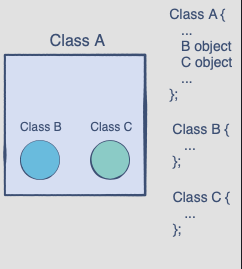
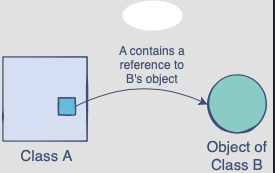

## Relationships between classes
#### Part-of
In this relationship, one class is a component of another class. Given two classes, class A and class B, they are in a part-of relation if class A is a part of class B or vice-versa.

An instance of the component class can only be created inside the main class. In the example to the right, class B and class C have their own implementations, but their objects are only created once a class A object is created. Hence, part-of is a dependent relationship.

#### Has-a
This is a slightly less concrete relationship between two classes. Class A and class B have a has-a relationship if one or both need the other’s object to perform an operation, but both classes can exist independently of each other.

This implies that a class has a reference to the object of the other class, but does not decide the lifetime of the other class’s referenced object.

#### Composition
Composition is accessing other classes objects in your class and owner class owns the object and is responsible for its lifetime. Composition relationships are Part-of relationships where the part must constitute part of the whole object. We can achieve composition by adding smaller parts of other classes to make a complex unit.

_In composition, the lifetime of the owned object depends on the lifetime of the owner._

#### Aggregation
Aggregation is very similar to composition. It also follows the Has-A model. This creates a parent-child relationship between two classes, with one class owning the object of another. Usually implemented with pointers.

_In aggregation, the lifetime of the owned object does not depend on the lifetime of the owner._

#### Association
In object-oriented programming, association is the relationship between the unrelated objects of the classes. Objects lifespan are not directly tied to each other like in composition and aggregation.

