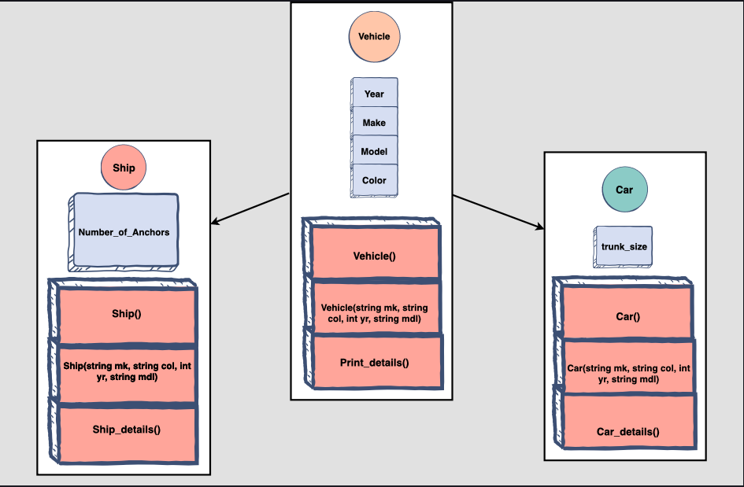
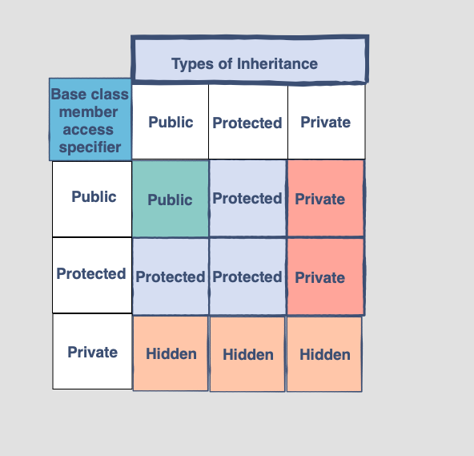
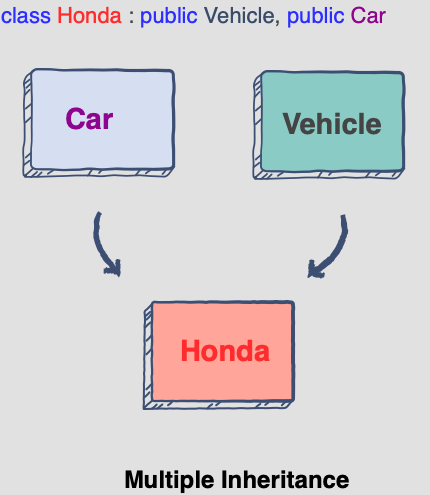
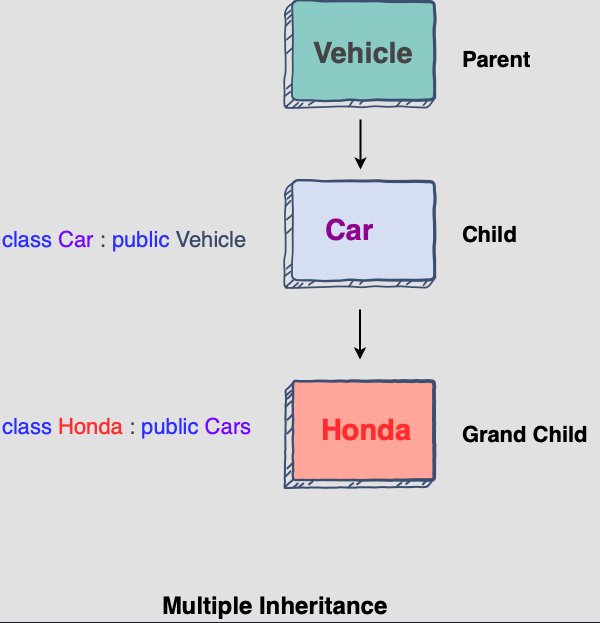
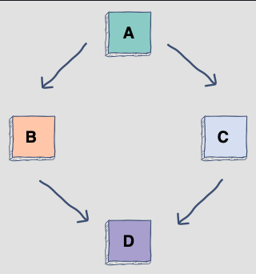

## Inheritence


#### Types of Inheritence


#### Multiple Inheritence


#### Multi Level Inheritence


#### Diamond Problem


One solution to the diamond problem is to use virtual inheritance, as shown in the following program.
```
class A
{
protected:
    int ID;
public:
    A() : ID(0) { }
};
 
class B:  virtual public A
{
public:
    int length;
};
 
 
class C:  virtual public A
{
public:
    int radius;
};
 
class D: public B, public C
{
public:
    int getID()  {   return ID;  }
};
```

**Virtual base classes are used in virtual inheritance in a way of preventing multiple “instances” of a given class appearing in an inheritance hierarchy when using multiple inheritances.**

virtual can be written before or after the public. Now only one copy of data/function member will be copied to class C and class B and class A becomes the virtual base class.
Virtual base classes offer a way to save space and avoid ambiguities in class hierarchies that use multiple inheritances. When a base class is specified as a virtual base, it can act as an indirect base more than once without duplication of its data members. A single copy of its data members is shared by all the base classes that use virtual base.

## Override and Final

#### Override
To override a method, the signature of the overridden method of the base class has to match exactly. Although this sounds easy in theory, it is often not in practice. If the signature of the method does not match exactly, the program will compile but have the wrong behavior… A different method than intended will be invoked.

#### Final
final supports two use cases. First, we can declare a method that cannot be overridden; second, we can define a class that cannot be derived from. The compiler uses the same rules to determine if a method of child class overrides a method of a base class. Of course, the strategy is inverted because the final specifier should disallow the overriding of a method. Therefore, the compiler checks the parameters of the method, its return type, and any const/volatile qualifiers.

A virtual method declared final must not be overridden.

