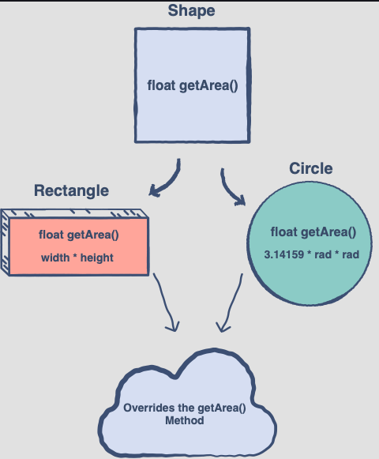

## Override with Polymorphism


#### Virtual Functions
A virtual function is a member function which is declared within the base class and is overridden by the derived class. When you refer to a derived class object using a pointer or a reference to the base class, you can call a virtual function for that object and execute the derived class’s version of the function.

Virtual functions ensure that the correct function is called for an object, regardless of the type of reference (or pointer) used for the function call. They are mainly used to achieve Runtime polymorphism. Functions are declared with a virtual keyword in a base class. The function resolution call is done at run-time.

#### Pure Virtual Member Functions
It may also provide an interface for the class hierarchy by placing at least one pure virtual function in the base class. A pure virtual function is one with the expression **=0** added to the declaration.
### =0
The equal sign = here has nothing to do with the assignment, the value 0 is not assigned to anything. The =0 syntax is simply how we tell the compiler that a virtual function will be pure.

Once you’ve placed a pure virtual function in the base class, you must override it in all the derived classes from which you want to instantiate objects. If a class doesn’t override the pure virtual function, it becomes an abstract class itself, and you can’t instantiate objects from it (although you might from classes derived from it). For consistency, you may want to make all the virtual functions in the base class pure.

**Abstract Class**
```
// A simple Shape interface which provides a method to get the Shape's area
class Shape {
  public:
  virtual float getArea() = 0;
};
```