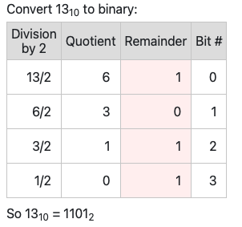
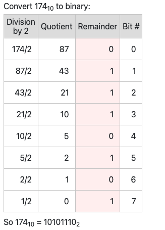
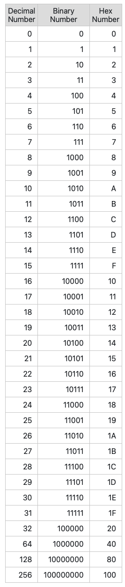

## How to convert decimal to binary

#### Conversion steps:
Divide the number by 2.
Get the integer quotient for the next iteration.
Get the remainder for the binary digit.
Repeat the steps until the quotient is equal to 0.

#### Example 1

#### Example 2

#### Conversion Table

