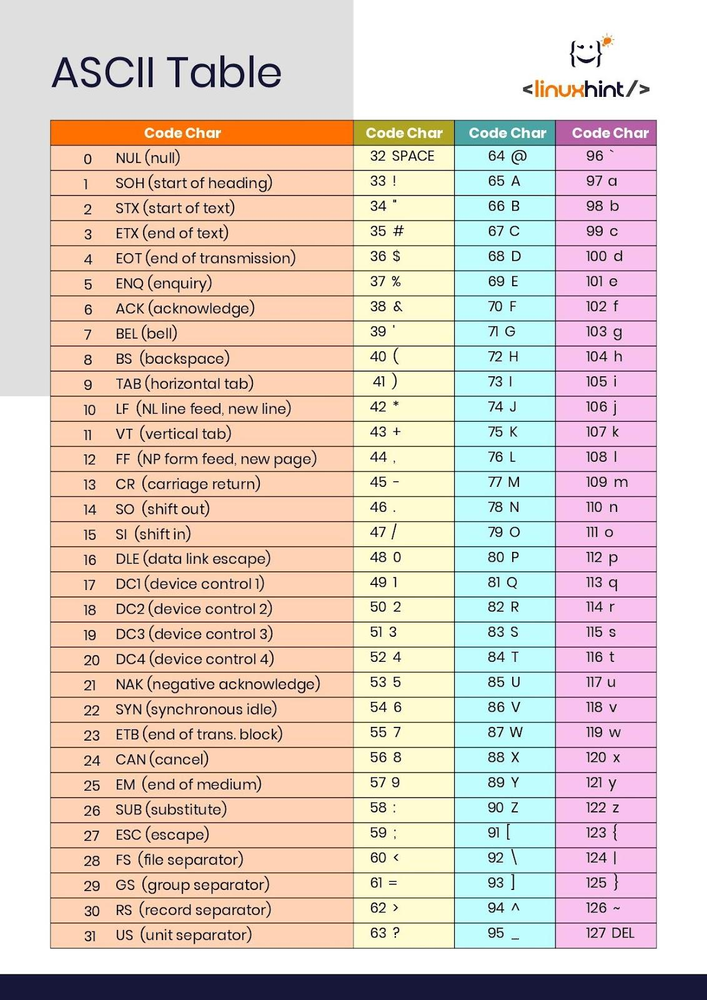

## Finding the previouse character.

an int can be converted to a character and vice versa. 

to do a conversion in cpp
```
char someCharacter = 'a';
cout << (int) someCharacter;
```

We prepend the type we want to convert it to before the variable.

ASCII is used as the standard for this conversion.

ASCII, abbreviated from **American Standard Code for Information** Interchange, is a character encoding standard for electronic communication. ASCII codes represent text in computers, telecommunications equipment, and other devices

_character converted to integer, integer then converted to binary._

