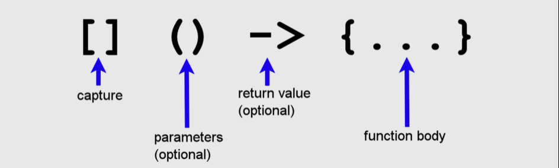
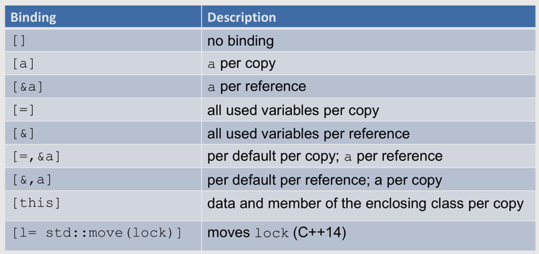

## Syntax

## Binding

The difference between the usage of functions and lambda functions boils down to two points:

1. We cannot overload lambdas.

2. A lambda function can capture local variables.
