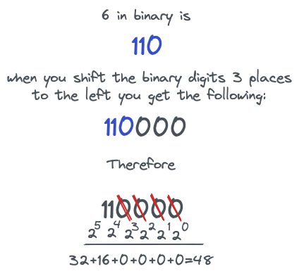

## Left Shift <<
operand1 << operand2 is equivalent to:
Multiplying operand1 by 2^operand2

Example:
```
int shifted = 2 << 3;
cout << shifted; // 16
```



## Right Shift >>
operand1 >> operand2 is equivalent to:
Dividing operand1 by 2^operand2