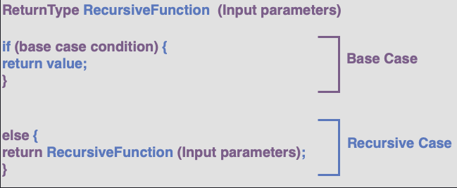
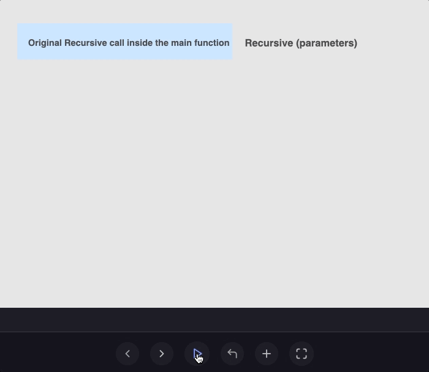

## Basic Syntax

## Illustration

## Base Case
The condition where the function stops calling itself in its body is known as the base case.
Every recursive function must have a base case or an error is generated because of memory overflow.

# Recursion vs Iteration
The following are the differences between recursion and iteration:

In the computer language, iteration allows you to repeat a particular set of instructions until the specified condition is met. The recursive function allows you to keep calling itself in the function body until some condition is met.

The sole purpose of iteration and recursion is to achieve repetition. Loops achieve repetition through the repetitive structure, whereas recursion achieves repetition through repetitive function calls.

Iteration terminates when loop condition fails. On the other hand, recursion terminates when the base condition evaluates to true.

Iteration happens inside the same function, which is why it takes less memory. In the recursive function, there is the overhead of function calls that makes our program slow and consumes more memory since each function call calls another copy of the function.

In iteration, our code size is very large. Meanwhile, recursion helps to write shorter code.

Iterative code is faster than recursive code.

Infinite loops will stop further execution of the program but do not lead to system crash. Infinite recursive calls, on the other hand, will result in a CPU crash because of memory overflow.

## Why use Recursion?
Using depends upon the requirements of your problem. The problems that can be defined in terms of itself are the best candidates for recursion.

Use recursion when a problem can be divided into simpler versions of itself. Consider the example of a file searching system. In a file searching system, you start with the main folder and then go through each subfolder to find a particular file.

For such a type of problem, use recursion. The recursive solution helps you write shorter and more understandable code that makes debugging easier.

However, if performance is your main concern, write the iterative solution since it takes less time and memory for its execution. Recursive calls take more time and extra memory.

That said, whichever you want to use is totally your choice.